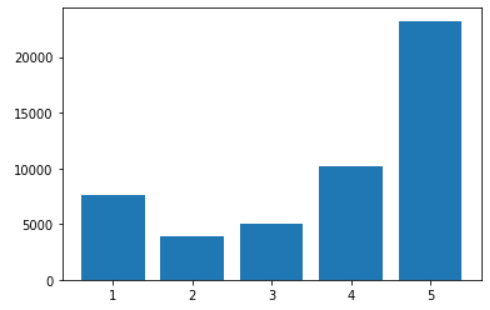

**Title**: Analyzing Sentiment in Yelp Reviews

**Abstract**: Our final project for DS4400 involved the analysis of sentiment in the Yelp reviews dataset. The dataset consists of text reviews, usually a few sentences long, and a "star" category reflecting how many stars the user assigned to the business they visited. We employed various models to attempt to predict the star category, including Naive Bayes, Logistic Regression, and LDA/QDA models, as well as various neural models. Overall, we found some interesting results with some high accuracy scores among certain models.

**Introduction:**

**Problem Statement:**

Computers and even humans have a hard time understanding typed/written messages, since there are no extralinguistic indicators to express emotions or tone (how many times has something like sarcasm been misinterpreted?). Additionally, not all users writing reviews are diligent. Someone may pick ratings for a product without being careful, leading to an inaccurate or inadequate review.

This report aims to better understand the connection between text comments for product reviews and the corresponding ratings given by users. While it may be the case that ratings match up well with the comments, there are bound to be exceptions to this.  Observing any discrepancies between numerical ratings and textual comments could indicate the quality of user reviews.

**Significance:**

All accurate reviews, positive or negative, are useful. However, when there are inconsistencies within a single review, the value of the review drops significantly. Locating discrepancies allows for a more holistic view of a product for both consumers and suppliers. E-commerce companies and their users could potentially elect to filter out these reviews to obtain more accurate representations of the product(s) they are dealing with.

**Approaches:**

Since we are attempting to classify text-based reviews as good or bad, we need to approach the problem with models suited to solve classification problems with sentiment analysis. Therefore, we plan to use some common types of **classification algorithms** including linear models, generative probabilistic algorithms, tree-based methods, and neural networks. **Linear models** assume a linear relationship between the input features and target variables.They are simple, fast, and can work well when the decision boundary is linear or when the input features are highly correlated. Linear models can also be easily interpreted and used to gain insight on which features are most important, but they may not be able to map out more complex relationships between the input features and sentiment. Another valid approach is to address the problem with **generative probabilistic classification algorithms**. These algorithms model the distribution of each class and use Bayes’ theorem to compute the posterior probability of each class based on the input features. Generative probabilistic classification algorithms can provide insight into the underlying data distribution, and they are effective in cases where there is limited training data. However, they may overfit training data and some of these algorithms, Naive Bayes, for example, assume independence between features which may or may not be realistic depending on the dataset. **Tree-based methods** construct decision trees to recursively divide the input feature space into regions such that each region consists of data points that are similar in terms of the target variable. These methods may not be the most effective for our sentiment analysis problem, but they generally offer a nice set of parameters for hypertuning which can allow for increased accuracy through cross-validation. **Neural networks** are a class of machine learning algorithms that mimic the structure and function of the human brain. They consist of layers of interconnected nodes that learn to transform the input features into a set of hidden representations that can be used to predict the target variable. Neural networks are generally more computationally expensive, but they generally provide the highest accuracy because of their ability to map complex relationships. We plan to use the Discovery cluster to address the slower runtimes that accompany neural networks. In terms of sentiment analysis, all of these approaches can be used to predict the sentiment of a text based on the frequency of certain words and phrases. In this case, we can predict whether a review is positive or negative based on the number of occurrences of positive or negative words.

**Setup:**

We obtained our data from the Yelp Dataset, a collection of datasets provided by Yelp for the purpose of learning NLP.  The particular dataset we chose to use was the review dataset, which contained the texts of customer reviews for various businesses.

The original dataset contained the following 9 columns:

* review_id - String - 22 character unique review ID
* user_id - String - 22 character unique user ID
* business_id - String - 22 character unique business ID
* stars - int - star rating
* date - String - date formatted as YYYY-MM-DD
* text - String - the review itself
* useful - int - number of useful votes received
* funny - int - number of funny votes received
* cool - int - number of cool votes received

For the purposes of this analysis, the only feature column used was **text**. This feature was used to predict target variable **stars**.

The following chart displays review frequencies for each category on a randomly sampled subset of the dataset of 50,000 samples (`data/yelp_academic_dataset_review_50k.txt`). As you can see, there are significantly more 5 star reviews than any other category. 

The neural models were trained on subsets of the entire dataset, so they might experience some bias as a result of the skewed distribution. The statistical models, not needing as much data, were trained on subsets of `data/yelp_academic_dataset_review_50k.txt`. Some of these subsets were built out using the `build_subset()` function which is able to produce versions of the dataset with balanced review frequencies for each category.

`build_subset()` allowed us to build different versions of the dataset with different distributions. It also allowed us to create datasets with any combination of review categories, e.g. only 1 and 5-star reviews, only 1, 2, 4, and 5- star reviews, etc. We tested our models accordingly, either predicting between two groups (1 and 5 stars, 1 or 2 and 4 or 5 stars, etc.) or multiple.

Various statistical models were evaluated, namely Naive Bayes, Logistic Regression, KNN, LDA, QDA, and SVM. For these models we used implementations provided by the [scikit-learn](https://scikit-learn.org/) library and in some cases also wrote up our own implementations (this was done for the Naive Bayes model and the Logistic Regression model). These models are all light-weight and were run locally on our personal machines.

Two neural models were assessed, a [pre-trained BERT](https://huggingface.co/bert-base-cased) provided by Hugging Face and a convolutional neural network trained from scratch. The BERT model is based on the Transformer architecture. The CNN was architected to have 3 filters The pre-trained model was fine-tuned on a small subset of the data (3,000 samples) and the CNN was trained on 487,500 samples. Both networks were trained on Northeastern University's high-performance computing resource, the Discovery cluster. 

**Results:**

Statistical Models:

We tasked our statistical models with the binary classification of separate star ratings as well as grouped star ratings.

Results for predicting between 1 and 5 stars (2, 3, 4 star reviews not included):

* Our Own Naive Bayes Bag-of-Words: 		    71.72% test accuracy
* Linear Discriminant Analysis: 	    72.38% test accuracy
* Quadratic Discriminant Analysis: 	    90.23% test accuracy
    * Optimal number of best features: 250
* K-Nearest Neighbors: 		80.73% test accuracy
    * Optimal k: 7
* Sklearn Logistic Regression: 		    96.59% test accuracy
* Our Own Logistic Regression: 	        73.91% test accuracy
* Linear Support Vector Classifier: 	95.77% test accuracy
* Decision Tree Classifier: 85.55% test accuracy

Results for predicting between (1 or 2 stars) and (4 or 5 stars) (3 star reviews not included):

* Our Own Naive Bayes Bag-of-Words: 		    65% test accuracy
* Linear Discriminant Analysis: 	    72.95% test accuracy
* Quadratic Discriminant Analysis: 	    86.61% test accuracy
    * Optimal number of best features: 200
* K-Nearest Neighbors: 	                76.51% test accuracy
    * Optimal k: 9
* Sklearn Logistic Regression: 		    92.27% test accuracy
* Our Own Logistic Regression: 	        68.91% test accuracy
* Linear Support Vector Classifier: 	92.53% test accuracy
* Decision Tree Classifier: 78.16% test accuracy

Results for predicting between (1 or 2 stars) and (3, 4, or 5 stars)

* Our Own Naive Bayes Bag-of-Words: 		    51.97% test accuracy
* Linear Discriminant Analysis: 	    72.38% test accuracy
* Quadratic Discriminant Analysis: 	    79.87% test accuracy
    * Optimal number of best features: 250
* K-Nearest Neighbors: 		            72.21% test accuracy
    * Optimal k: 9
* Sklearn Logistic Regression: 		    85.39% test accuracy
* Our Own Logistic Regression: 	        70.45% test accuracy
* Linear Support Vector Classifier: 	85.82% test accuracy
* Decision Tree Classifier: 71.13% test accuracy

Neural Models:

We evaluated the neural models on the task of multiclass classification, such that they predicted an exact star rating from 1 to 5, as opposed to a binary grouping. The results were as follows:

* CNN: 			    86% test accuracy
* Fine-tuned BERT: 	64.4% test accuracy

**Discussion:**

Overall, the test accuracies for every single model were above 50%, which is a very good result, especially considering how volatile an NLP dataset can be. Of particular success were the support vector classifier, sklearn’s logistic regression, and quadratic discriminant analysis. Each of the models performed best when the extreme star ratings of 1 and 5 only were considered, with greater drop off in performance as star ratings of 2 and 4, and eventually 3 were added. In the case where all 5 star ratings were used, the CNN model actually outperformed the statistical models, even though the statistical models had those star ratings grouped for a binary classification. However, the drop in the accuracy of the statistical models in that case could be attributed to the fact that it is difficult to determine whether a review with a star review of 3 is positive or negative. 

**Conclusion:**

The goal of this project was to analyze the sentiment of text-based Yelp reviews and classify them as positive or negative. We proposed and tested many approaches to this problem including using common types of classification algorithms like linear models, generative probabilistic algorithms, tree-based methods, and neural networks. Specifically, we evaluated statistical models such as Naive Bayes, logistic regression, k-nearest neighbors, linear and quadratic discriminant analysis, and support vector machines as well as two neural models, a pre-trained BERT and a convolutional neural network. Using subsets of the Yelp dataset, we were able to compare and contrast these algorithms and identify the most effective approaches for classification with sentiment analysis. This research not only provides insight into the validity of Yelp’s user feedback, but it can also help companies obtain an accurate representation of customer approval for their products and services.

**References:**

https://www.analyticsvidhya.com/blog/2021/09/a-deep-dive-into-transformers-library/

https://huggingface.co/docs/transformers/training

https://github.com/bentrevett/pytorch-sentiment-analysis

https://scikit-learn.org/stable/tutorial/text_analytics/working_with_text_data.html

https://towardsdatascience.com/sentiment-analysis-using-logistic-regression-and-naive-bayes-16b806eb4c4b

https://github.com/llSourcell/logistic_regression/blob/master/Sentiment%20analysis%20with%20Logistic%20Regression.ipynb

https://web.stanford.edu/~jurafsky/slp3/4.pdf

https://web.stanford.edu/~jurafsky/slp3/5.pdf
